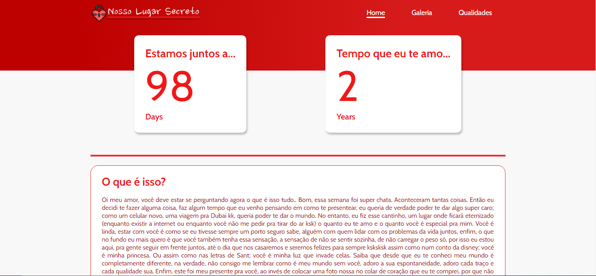
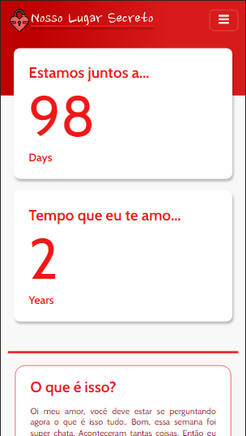

<h1 align="center">Nosso Lugar Secreto💖</h1>

## O que é?

    Este é um projeto desenvolvido como uma forma de presente para minha namorada, a cachorrinha dela tinha falecido recentemente e ela estava bem mal por este fato. Então decidi fazer uma surpresa pra ela, desenvolvendo esse projeto e colocando uma forma de acesso facil, como um QR Code colocado dentro de um relicário em formato de coração. O projeto foi hospedado no github pages, podemos ver o resultado <a href="https://nandins-12.github.io/nosso-lugar-secreto/">aqui.</a>

 

## Sobre o projeto

### Tecnologias:

O projeto foi desenvolvido todo em:

* __HTML:__ Linguagem de marcação.

* __CSS:__ No CSS temos um breakpoint definido na largura máxima de `845px`, permitindo que a aplicação seja responsiva e compátivel para a maioria dos dispositivos.

* __JavaScript:__ No JavaScript temos um pequeno script que será responsavel por fazer as contagens automáticas dos dias e dos anos nos cards da seção `#square-cards`, subsequentemente temos uma função a qual é responsavel por alterar classes de elementos no DOM, função essa que tem o objetivo de auxiliar a implementação do menu-humburguer.

### Previews:

    
    

